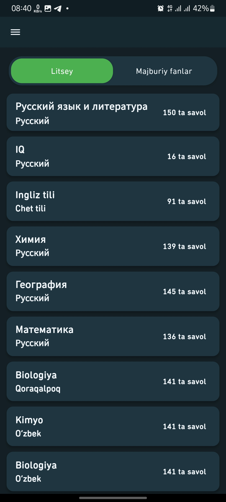
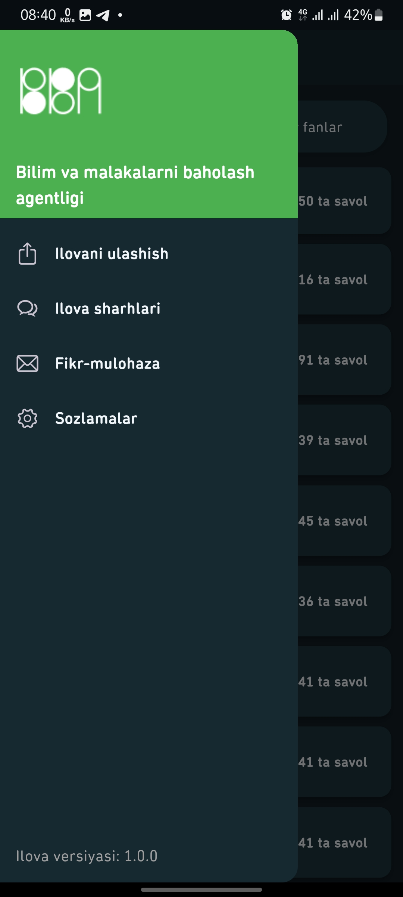
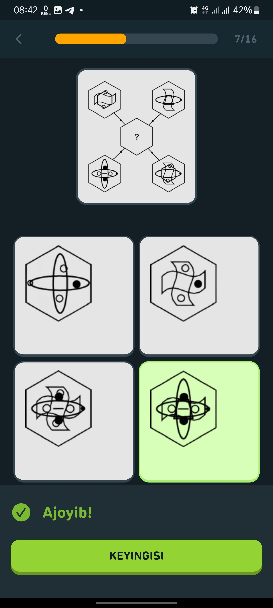
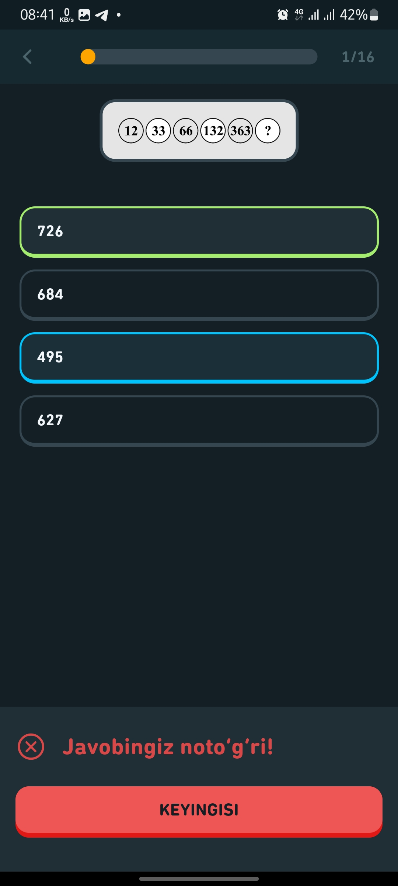
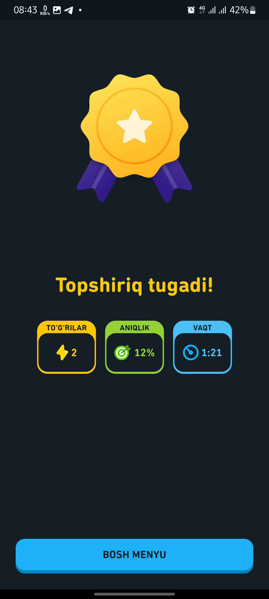
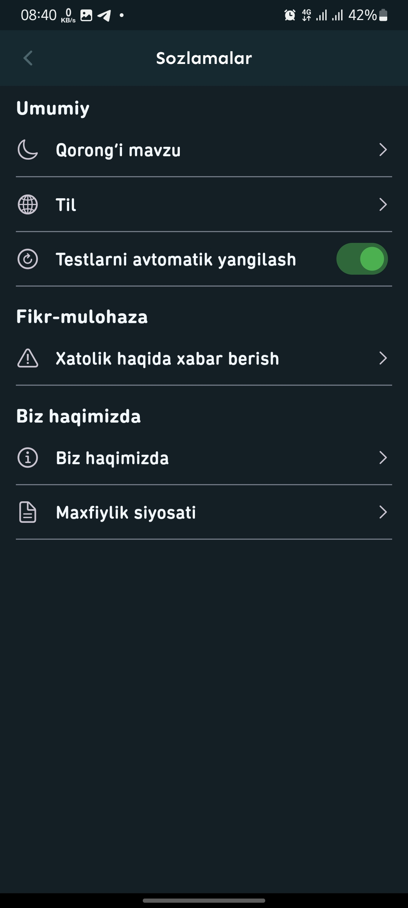

# DTM Test App 📚

Welcome to the **DTM Test App** repository! This is a comprehensive Flutter-based mobile application designed for educational testing and assessment. Built with modern architecture and state management patterns, it provides an intuitive and efficient testing experience for students preparing for DTM exams.

---

## 📱 **App Overview**

DTM Test App is a mobile testing platform that helps students prepare for DTM (State Testing Center) exams. The application features interactive quizzes, progress tracking, and comprehensive test analysis to enhance the learning experience. Built with Flutter, it delivers a smooth, cross-platform experience with modern UI/UX design.

---

## 📦 **Download**

Get the app from Google Play Store:

[](https://play.google.com/store/apps/details?id=uz.dtm.dtm_test_app)

Or download the APK directly:
- [DTM Test App.apk](./DTM%20Test%20App.apk)

---

## 📸 **Screenshots**

<table>
  <tr>
    <td></td>
    <td></td>
    <td></td>
  </tr>
  <tr>
    <td></td>
    <td></td>
    <td></td>
  </tr>
</table>

---

## ⚙️ **Technologies Used**

This project is built with **Flutter SDK (>=3.6.1)** and utilizes modern libraries and technologies:

### Core Technologies:
- **Flutter SDK 3.6.1** - Cross-platform mobile development framework
- **Dart** - Programming language

### State Management & Architecture:
- **flutter_bloc** - Business Logic Component for state management
- **get_it** - Service locator for dependency injection
- **get** - Navigation and state management utilities

### Backend & Database:
- **supabase_flutter** - Backend-as-a-Service for authentication and real-time database
- **isar & isar_flutter_libs** - High-performance local database
- **hive & hive_flutter** - Lightweight key-value database
- **shared_preferences** - Local data persistence

### UI & Animations:
- **lottie** - Vector animations for enhanced user experience
- **animations** - Advanced animation widgets
- **flutter_staggered_animations** - Staggered animations
- **flutter_screenutil** - Screen adaptation for responsive design
- **awesome_bottom_bar** - Custom bottom navigation
- **dotted_border** - Custom border designs
- **percent_indicator** - Progress indicators

### Utilities & Features:
- **image_picker & image** - Camera and gallery integration
- **flutter_svg** - SVG image support
- **workmanager** - Background task scheduling
- **device_info_plus** - Device information
- **share_plus** - Social sharing functionality
- **pull_to_refresh** - Enhanced user interaction
- **logger** - Logging utility
- **intl** - Internationalization
- **html & latext** - HTML and LaTeX rendering

---

## 🏗️ **Project Structure**

Based on the provided structure, the project follows a clean architecture pattern:

```
lib/
├── config/                 # App configuration
│   ├── theme/             # Theme configuration
│   ├── app_dependency.dart    # Dependency injection setup
│   ├── app_routes.dart        # Navigation routes
│   └── app_translation.dart   # Localization
├── core/                   # Core utilities and constants
│   ├── animations/        # Custom animations
│   ├── constants/         # App constants
│   ├── extensions/        # Dart extensions
│   ├── helpers/          # Helper functions
│   ├── preferences/      # SharedPreferences wrapper
│   ├── style/           # App styling
│   ├── utils/           # Utility functions
│   └── widgets/         # Reusable widgets
├── features/              # Feature-based modules
│   └── main/             # Main feature module
│       ├── data/         # Data layer
│       ├── domain/       # Business logic layer
│       └── presentation/ # UI layer
└── main.dart             # App entry point
```

---

## 🚀 **Key Features**

- ✅ Interactive test sessions with multiple question types
- 📊 Real-time progress tracking and analytics
- 🎯 Personalized learning recommendations
- 📱 Offline mode for uninterrupted studying
- 🎨 Modern, intuitive user interface
- 🔔 Background notifications and reminders
- 📈 Detailed performance statistics
- 🌙 Dark/Light theme support

---

## 📄 **License**

This project is licensed under the MIT License - see the [LICENSE](LICENSE) file for details.

---

## 📞 **Contact**

For any questions or suggestions, feel free to reach out:

- 📞 Call: 1195
- 🌐 Website: [uzbmb.uz](https://uzbmb.uz/)
- 📱 Google Play: [DTM Test App](https://play.google.com/store/apps/details?id=uz.dtm.dtm_test_app)

---

**Made with ❤️ in Uzbekistan**
